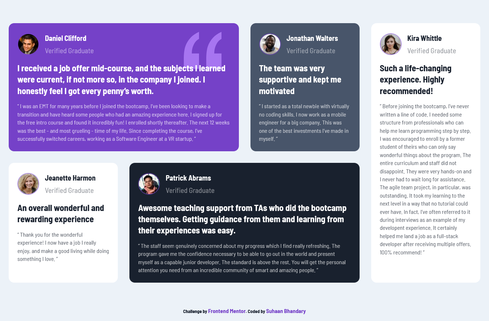

# Frontend Mentor - Testimonials grid section solution

This is a solution to the [Testimonials grid section challenge on Frontend Mentor](https://www.frontendmentor.io/challenges/testimonials-grid-section-Nnw6J7Un7).
Try it yourself 😀

## Table of contents

- [Frontend Mentor - Testimonials grid section solution](#frontend-mentor---testimonials-grid-section-solution)
  - [Table of contents](#table-of-contents)
  - [Overview](#overview)
    - [The challenge](#the-challenge)
    - [Screenshot](#screenshot)
    - [Links](#links)
    - [Built with](#built-with)
    - [Motive](#motive)
  - [Author](#author)
  - [Acknowledgments](#acknowledgments)

## Overview

### The challenge

Users should be able to:

- View the optimal layout for the site depending on their device's screen size

### Screenshot

### Links

- Solution URL: [Add solution URL here]()
- Live Site URL: [Add live site URL here]()

### Built with

- Semantic HTML5 markup
- CSS custom properties
- Flexbox
- CSS Grid
- Mobile-first workflow

### Motive

Took this project to try out Grid and also the grid template areas.

## Author

- LinkedIn - [Suhaan-Bhandary](www.linkedin.com/in/suhaan-bhandary)
- Frontend Mentor - [@Suhaan-Bhandary](https://www.frontendmentor.io/profile/Suhaan-Bhandary)

## Acknowledgments

If you are new to Grid or want to brush up you skills then checkout the below videos:
[Travery Media Video on Grid](https://youtu.be/0xMQfnTU6oo)
[Kevin Powell Video on Grid](https://youtu.be/rg7Fvvl3taU)
